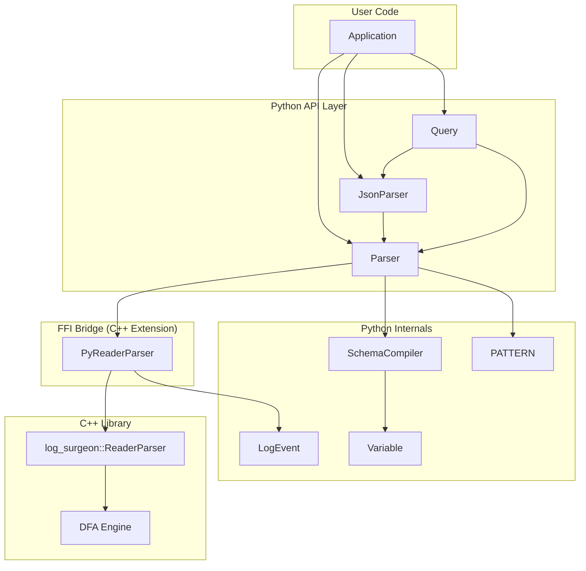
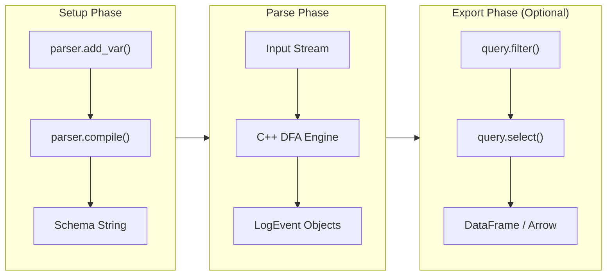

# Architecture

This document describes the internal architecture of `log-surgeon-ffi`.

## Overview

`log-surgeon-ffi` is a Python wrapper around the high-performance C++ [`log-surgeon`](https://github.com/y-scope/log-surgeon) library. The architecture follows a layered design with a clear FFI (Foreign Function Interface) boundary.



## Component Layers

### 1. Python API Layer

The public interface that users interact with:

| Component | Purpose |
|-----------|---------|
| **Parser** | High-level interface for extracting structured data from text logs |
| **JsonParser** | Wrapper for parsing JSON-formatted logs (NDJSON or JSON arrays) |
| **Query** | Fluent builder for filtering, selecting, and exporting to DataFrames |

### 2. Python Internals

Supporting classes that power the API:

| Component | Purpose |
|-----------|---------|
| **SchemaCompiler** | Builds log-surgeon schema definitions from `add_var()` calls |
| **LogEvent** | Represents a parsed log event with extracted variables |
| **PATTERN** | Pre-built regex patterns for common log elements (IP, UUID, etc.) |
| **Variable** | Data class representing a schema variable definition |

### 3. FFI Bridge

The C++ extension module that bridges Python and C++:

| Component | Purpose |
|-----------|---------|
| **PyReaderParser** | Python wrapper around `log_surgeon::ReaderParser` |

### 4. C++ Library

The core parsing engine from [log-surgeon](https://github.com/y-scope/log-surgeon):

| Component | Purpose |
|-----------|---------|
| **ReaderParser** | Stream-based log parser with DFA matching |
| **DFA Engine** | Deterministic finite automaton for efficient pattern matching |

## Data Flow



### Detailed Flow

1. **Schema Definition**
   ```python
   parser = Parser()
   parser.add_var("metric", rf"value=(?<value>{PATTERN.INT})")
   ```
   - `SchemaCompiler` collects variable patterns
   - Extracts capture group names from regex
   - Tracks priority for ordering

2. **Compilation**
   ```python
   parser.compile()
   ```
   - `SchemaCompiler.compile()` generates schema string
   - Schema passed to C++ `ReaderParser`
   - C++ builds DFA for efficient matching

3. **Parsing**
   ```python
   for event in parser.parse(log_file):
       print(event["value"])
   ```
   - Input streamed to C++ engine
   - DFA matches patterns in single pass
   - `LogEvent` objects returned with extracted data

4. **Export (Optional)**
   ```python
   df = Query(parser).select(["*"]).from_(log_file).to_dataframe()
   ```
   - `Query` wraps parsing with filtering/selection
   - Exports to pandas DataFrame or PyArrow Table

## Design Decisions

### Why FFI instead of Pure Python?

- **Performance**: C++ DFA engine is significantly faster than Python regex
- **Single-pass parsing**: DFA matches all patterns simultaneously
- **Memory efficiency**: Stream processing without loading entire file

### Why Schema Compilation?

- **DFA construction**: Patterns must be compiled into state machine
- **Optimization**: Combined matching is faster than sequential regex
- **Validation**: Catch pattern errors before parsing begins

### Why Delimiter-Based Matching?

- **Log structure alignment**: Logs naturally have delimited fields
- **Predictable behavior**: `.` stops at natural boundaries
- **Efficient log types**: Templates align with log structure

## Roadmap

A Rust re-implementation of the core parsing engine is in development, which will bring:

- **Improved performance** through Rust's zero-cost abstractions
- **Memory safety** guarantees without garbage collection overhead
- **Enhanced features** including additional regex capabilities
- **Simplified builds** with easier cross-platform compilation via PyO3

The Python API will remain stable—only the underlying engine will change.
