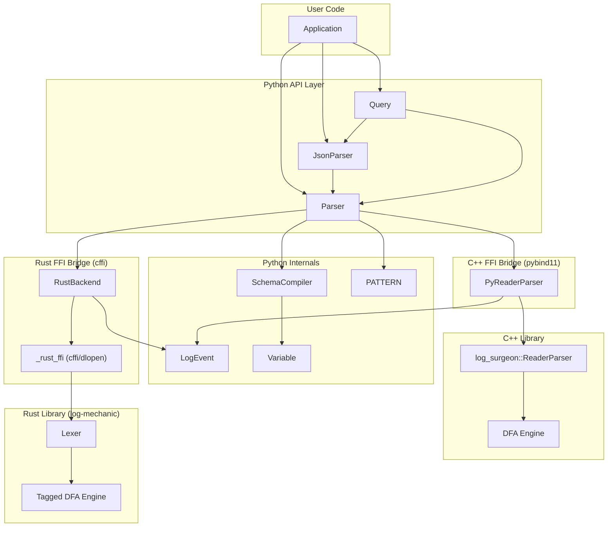
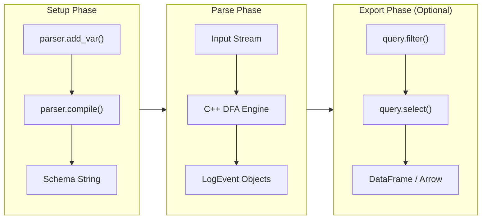

# Architecture

This document describes the internal architecture of `log-surgeon-ffi`.

## Overview

`log-surgeon-ffi` is a Python wrapper around the high-performance [`log-surgeon`](https://github.com/y-scope/log-surgeon) library. It supports two backend engines (C++ and Rust) behind a unified Python API. The architecture follows a layered design with clear FFI (Foreign Function Interface) boundaries.



## Component Layers

### 1. Python API Layer

The public interface that users interact with:

| Component | Purpose |
|-----------|---------|
| **Parser** | High-level interface for extracting structured data from text logs |
| **JsonParser** | Wrapper for parsing JSON-formatted logs (NDJSON or JSON arrays) |
| **Query** | Fluent builder for filtering, selecting, and exporting to DataFrames |

### 2. Python Internals

Supporting classes that power the API:

| Component | Purpose |
|-----------|---------|
| **SchemaCompiler** | Builds log-surgeon schema definitions from `add_var()` calls |
| **LogEvent** | Represents a parsed log event with extracted variables |
| **PATTERN** | Pre-built regex patterns for common log elements (IP, UUID, etc.) |
| **Variable** | Data class representing a schema variable definition |

### 3. FFI Bridges

Two backend engines are available, selected via `Parser(backend=...)` or the `LOG_SURGEON_BACKEND` environment variable:

**C++ Backend** (default) — pybind11 extension module:

| Component | Purpose |
|-----------|---------|
| **PyReaderParser** | Python wrapper around `log_surgeon::ReaderParser` |

**Rust Backend** — cffi ABI mode (dlopen):

| Component | Purpose |
|-----------|---------|
| **RustBackend** | Bridges Rust lexer fragments to LogEvent objects; supports context manager protocol |
| **_rust_ffi** | cffi bindings (dlopen) for the `liblog_mechanic` shared library (bundled in wheel) |

### 4. Native Libraries

**C++ Library** — [log-surgeon](https://github.com/y-scope/log-surgeon):

| Component | Purpose |
|-----------|---------|
| **ReaderParser** | Stream-based log parser with DFA matching |
| **DFA Engine** | Deterministic finite automaton for efficient pattern matching |

**Rust Library** — log-mechanic (in the log-surgeon repo under `rust/`):

| Component | Purpose |
|-----------|---------|
| **Lexer** | Fragment-based lexer using tagged DFA simulation |
| **Tagged DFA** | DFA with capture group tracking via registers and prefix trees |

## Data Flow



### Detailed Flow

1. **Schema Definition**
   ```python
   parser = Parser()
   parser.add_var("metric", rf"value=(?<value>{PATTERN.INT})")
   ```
   - `SchemaCompiler` collects variable patterns.
   - Extracts capture group names from regex.
   - Tracks priority for ordering.

2. **Compilation**
   ```python
   parser.compile()
   ```
   - **C++ backend:** `SchemaCompiler.compile()` generates a schema string, which is passed to the C++ `ReaderParser` to build a DFA.
   - **Rust backend:** `RustBackend` creates a Rust `Schema` via FFI, adds rules individually, then constructs a `Lexer` (which builds the tagged DFA internally).

3. **Parsing**
   ```python
   for event in parser.parse(log_file):
       print(event["value"])
   ```
   - **C++ backend:** Input streamed to C++ engine; DFA matches patterns in a single pass; `LogEvent` objects returned directly.
   - **Rust backend:** Input passed to Rust lexer via FFI; lexer returns fragments (matched regions with captures); `RustBackend` reconstructs `LogEvent` objects in Python, assembling log types and grouping fragments into events.

4. **Export (Optional)**
   ```python
   df = Query(parser).select(["*"]).from_(log_file).to_dataframe()
   ```
   - `Query` wraps parsing with filtering/selection.
   - Exports to pandas DataFrame or PyArrow Table.

## Design Decisions

### Why FFI instead of pure Python?

Both the C++ and Rust libraries provide DFA-based parsing engines that match all patterns in a single pass. Wrapping these via FFI preserves performance characteristics while providing a Pythonic API. A pure Python re-implementation would require reimplementing the DFA engine, which would be slower and duplicate effort.

### Why two backends?

The C++ backend is the original, mature implementation. The Rust backend (log-mechanic) is a newer implementation that offers memory safety guarantees and is under active development. Both share the same Python API, allowing users to switch between them transparently.

### Why is the Rust backend slower in benchmarks?

The top two reasons:

1. **Where the work runs.** The C++ library does full parsing and event assembly in native code and returns one complete `LogEvent` per `parse_next_log_event()` call. The Rust FFI exposes a **lexer** that returns **fragments** (one per regex match). The Python layer then groups fragments into events, builds log types, and constructs `LogEvent` in Python. So the Rust path does more work in Python and more per-event work outside the native library.

2. **FFI round-trips per event.** The C++ path does one pybind11 call per event. The Rust path does one cffi call per **fragment** (often several per line) plus per-capture reads when copying data, so there are many more cross-boundary calls per event.

### How is the Rust library distributed?

The `liblog_mechanic` shared library is built from source during the wheel build process using Cargo
and bundled directly inside the wheel. The build system handles platform differences automatically:

- **Linux glibc**: native `cargo build --release`
- **Linux musl**: cross-compiled with the appropriate musl target
- **macOS**: universal2 fat binary via `lipo` (both arm64 and x86_64)

At runtime, `_rust_ffi.py` discovers the bundled library from the package directory without any
user configuration.

### Why a two-phase compile/parse API?

The `compile()` step builds the DFA from regex patterns. This separation:
- Validates patterns before parsing begins.
- Allows the DFA to be built once and reused across multiple parse calls.
- Mirrors the underlying native library API structure.
